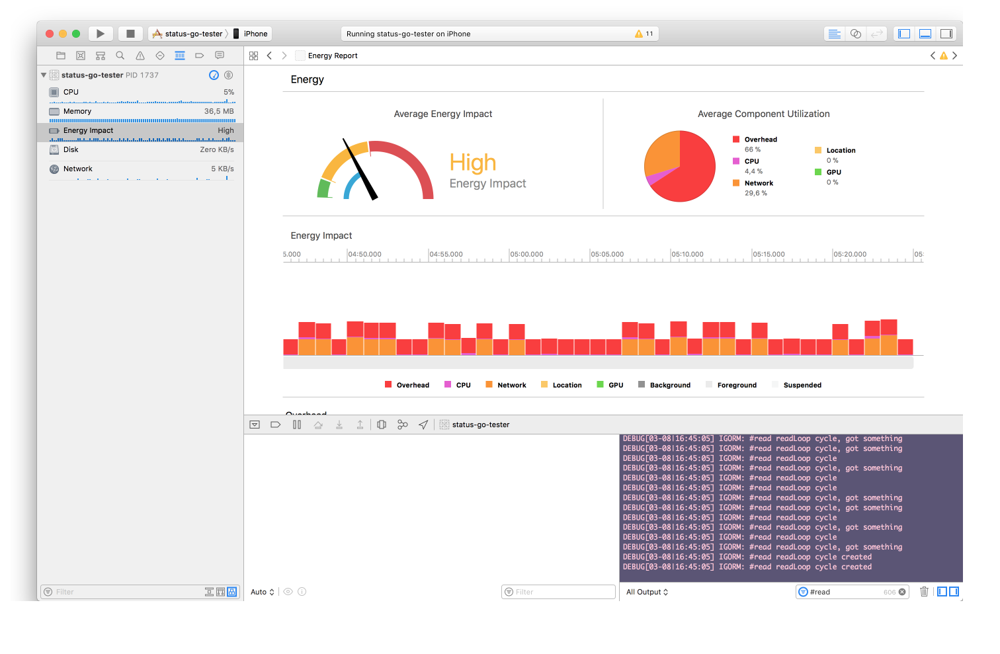

# status-go-n-wrapper
Native simple wrapper for status-go for iOS and Android.

Used for testing energy efficiency of status-go on a device itself.

### Using iOS Wrapper

1. `make statusgo-ios`
2. `open ios/status-go-tester/status-go-tester.xcodeproj`
3. Build, run and trace.

---

# Energy Guide

##  What impacts battery performance?

### 1. CPU
That one is obvious, if the app consumes too much CPU, it won't be energy efficient. 

Is's important to test this data *on a device*. 

1. Desktop CPUs have different architecture and some algorithms that are hardware accelerated on a desktop-class CPU might cause bottlenecks in a mobile processor.

2. Mobile operating systems might have different syscalls implemented with different efficency.

Hence, everything should be profiled and optimized in an environment as close to what an end user will have.

**Instruments to triage CPU bottlenecks**
iOS: Instruments (Time Profiler)

### 2. Networking

One important trick that allows devices to live that long from a battery is that they try to switch to a low-power mode as soon as it is possible.

That relates not only to CPU but also to the networking stack. Radios that are used in the wireless connections are very resource-hungry. To workaround that limitation, system tries to turn them on fully only when it absolutely has to.  That is usually some timeout after the network packets were sent or received.

One important consequence of that fact is that if the packets are all sent and
received randomly, the radio will never have a chance to switch into a low
power mode.

To avoid that, networking should happen in "bursts", when during a short period of time a lots of packets are sent/received.


*source: [Apple: Energy & Networking](https://developer.apple.com/library/content/documentation/Performance/Conceptual/EnergyGuide-iOS/EnergyandNetworking.html)*

#### 2.1. Networking, Energy and open sockets.
If socket connection is open, but isn't active (no reads or writes happening) that doesn't prevent radios to go into a low-power mode.
Even if there is a read operation from a socket, if a server doesn't write anything, it still helps with energy preservation.
That way, by grouping socket messages, we can improve the battery performance.

*The way how energy efficient networking can be controlled by a server*

Client code (no specific optimizations)
```go
for {
       tcpAddr, _ := net.ResolveTCPAddr("tcp4", address)
       conn, _ := net.DialTCP("tcp", nil, tcpAddr)
       for {
               result := make([]byte, 10)
               io.ReadFull(conn, result)
               fmt.Println(string(result))
       }
}

```

Server code (energy efficient).

```python
import socket
import time
import sys

TCP_IP = '0.0.0.0'
TCP_PORT = 5008
MESSAGE = "1234567890"

BUFFER_SIZE = 20  # Normally 1024, but we want fast response

s = socket.socket(socket.AF_INET, socket.SOCK_STREAM)
s.bind((TCP_IP, TCP_PORT))
s.listen(1)

conn, addr = s.accept()
print 'Connection address:', addr
try:
    while 1:
        print 'Sending', MESSAGE
        for i in range(500):
            conn.send(MESSAGE) 
        print "sleeping"
        for i in range(30):
            print i,
            sys.stdout.flush()
            time.sleep(1) # seconds
finally:
    conn.close()
    print 'Closed'
```

#### 2.2 The Tradeoff

There is a tradeoff between having energy efficient networking and real-time communications. The time that is needed for the radio to go to the low-power mode is quite substantal (>= 10 seconds). That can easily be seen in "overhead" graph in Xcode.
That rate means that any app that requires real-time communication (a messsenger) will not be energy efficient in foreground.

What is possible to do, is to reduce energy consumption is background. There, we can sync data more rarely, or only by a signal of a silent push notification.


**Instruments to triage networking issues**

iOS: Xcode (Energy Efficiency, Network), Instruments (Network)

Android: TBD


## Profiling Process: iOS

**‼️** Instrument's "Energy Usage Log" [**seems to be broken** on iOS 10/11](https://forums.developer.apple.com/thread/70540) **‼️**

1. Profiling should happen using Wi-Fi debugging feature.
Otherwise, the device will be charging during the measuring process and that will skew the data.

2. Profiling should happen only on a device.

3. Profiling should happen on a **release** build configuration.
Different debugging mechanisms can add much additional overhead, hiding the
actual reasons on why something isn't efficient.

#### Tools
**Xcode: Debug Navigator**


What is "Overhead"? That is energy impact of "other system resources".
An example of that is a radio that is in high-power mode after networking data exchange.

**Instruments: Time Profiler, Network**


## Profiling Process: Android

TBD


# Read further

## iOS


- [Energy Efficiency Guide for iOS Apps](https://developer.apple.com/library/content/documentation/Performance/Conceptual/EnergyGuide-iOS/index.html#//apple_ref/doc/uid/TP40015243-CH3-SW1)

- WWDC sessions
    - 2017: 238
    - 2015: 708
    - 2014: 710, 712

