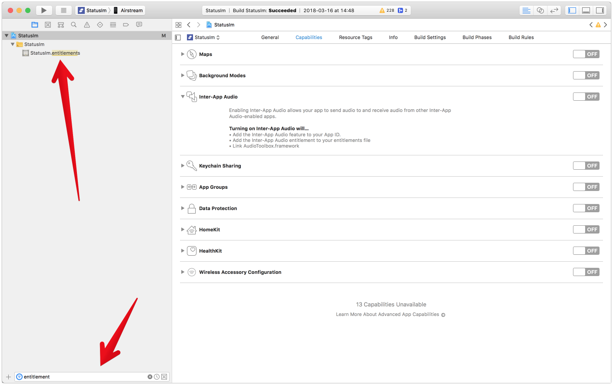
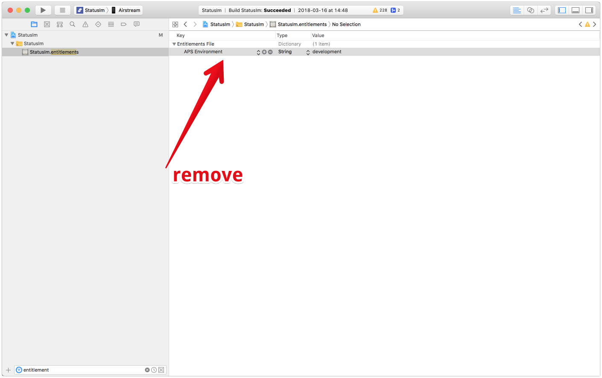
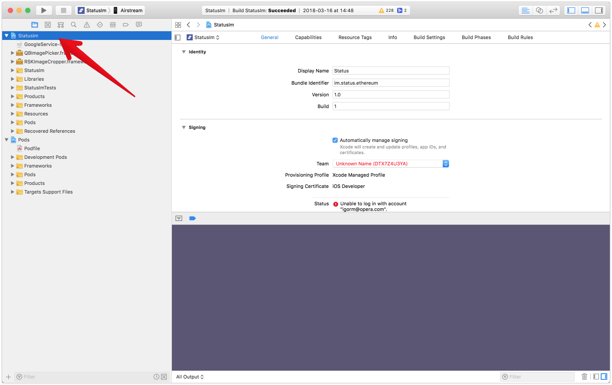
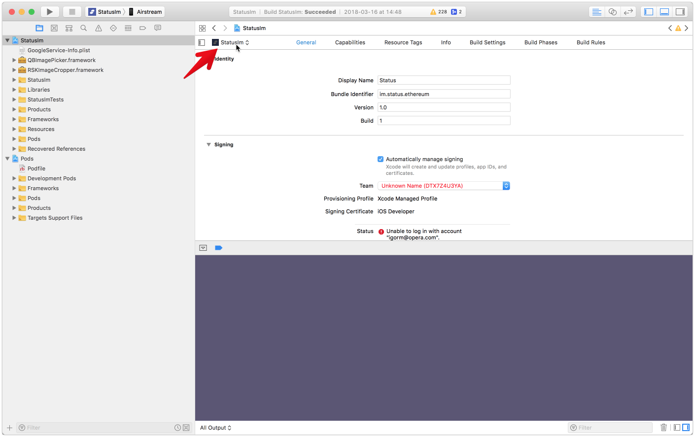
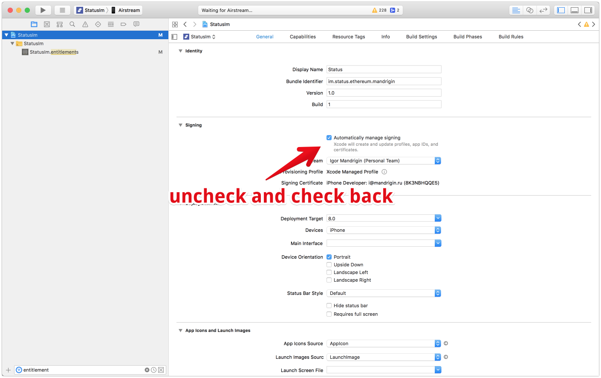
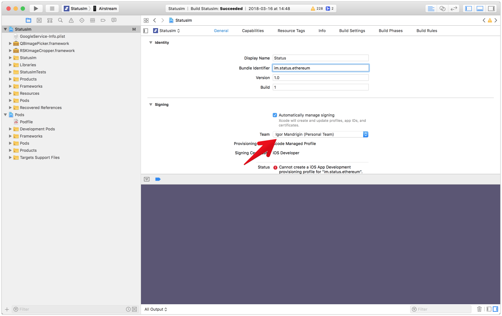
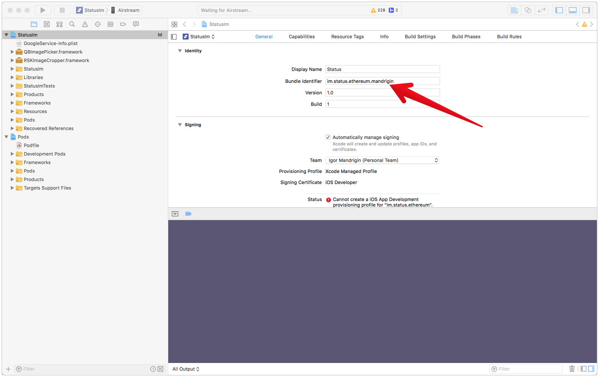
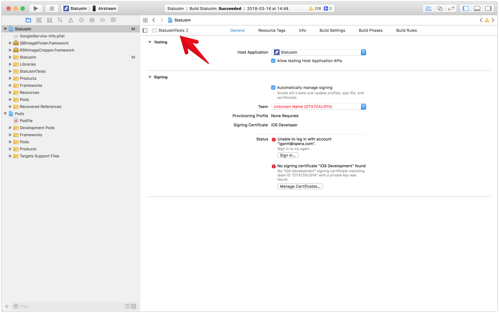
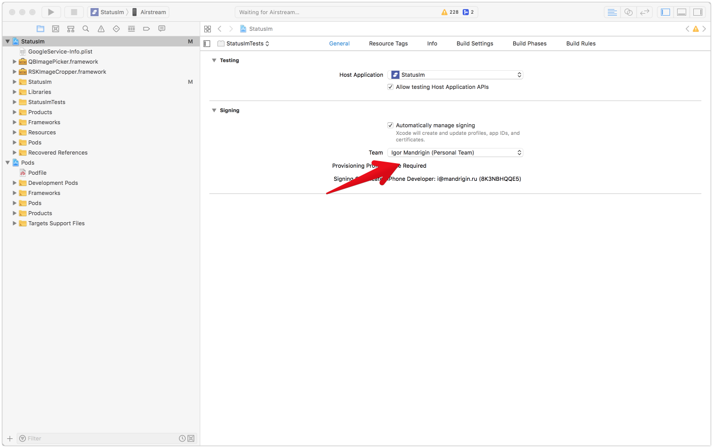

# What if you have no provisioning profile?

1. Disable push notifications for the project.
   
   

1. Select `StatusIm` in the Project Navigator.
   

1. Select `StatusIm` from the list of targets. 
   

1. Set the signing to "automatic".
   
   
1. Rename project name with your prefix. 
   

1. Rename unit-tests name with your prefix. 
 

